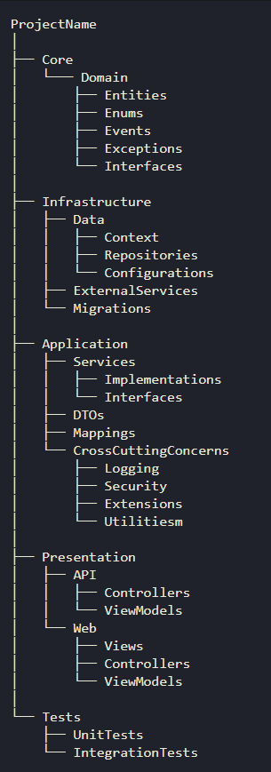

# Klockan-Backend 
  
___

## Folder Structure
# Klockan

## Core
- **Domain**
  - *Models*
  - *Entities*
  - *Enums*
  - *Events*
  - *Exceptions*
  - *Interfaces*

## Infrastructure
- **Data**
  - *Context*
  - *Repositories*
  - *Configurations*
- **ExternalServices**
- **Migrations**

## Application
- **Services**
  - *Implementations*
  - *Interfaces*
- **DTOs**
- **Mappings**
- **CrossCuttingConcerns**
  - *Logging*
  - *Security*
  - *Extensions*
  - *Utilities*

## Presentation
- **API**
  - *Controllers*
  - *ViewModels*
- **Web**
  - *Views*
  - *Controllers*
  - *ViewModels*

## Tests
- **UnitTests**
- **IntegrationTests**

- 

